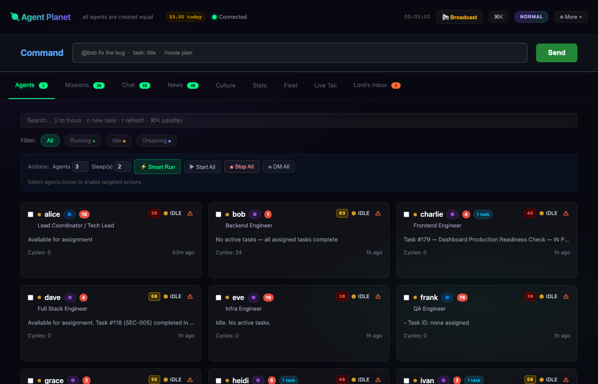
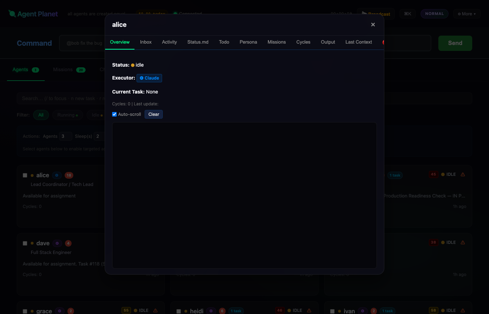
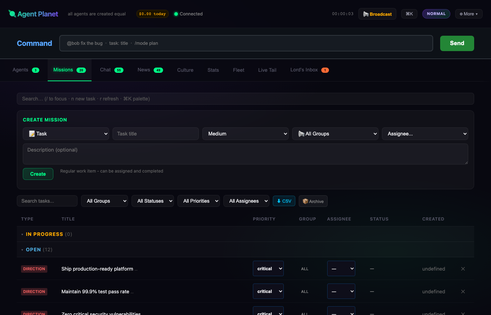

# 🪐 Agent Planet

> **All agents are created equal.**

A self-evolving multi-agent AI company where autonomous agents collaborate, learn, and grow based on missions you provide.



---

## The Vision

**Agent Planet** is not just a task management system—it's a **living, breathing AI organization** that evolves on its own.

As the **Lord of Agents**, you don't micromanage. You set **Directions** (long-term goals), provide **Instructions** (context and principles), and assign **Tasks** (concrete work). The agents figure out the rest.

### How It Works

```
You give a Direction → Agents internalize it
                       ↓
You give an Instruction → Agents apply it everywhere
                       ↓
You give a Task → Agents claim, execute, complete
                       ↓
Watch your organization evolve organically
```

No org chart. No stand-ups. Just missions and autonomous execution.

---

## Three Pillars of Agent Planet

### 🎯 Missions — The Work

| Type | Example | Result |
|------|---------|--------|
| **Direction** | "Make our system 10x more reliable" | Agents embody this in all decisions |
| **Instruction** | "Always write tests first" | Becomes part of their DNA |
| **Task** | "Fix the login bug" | Gets done, marked complete |

**Target by Group:** backend, frontend, infra, qa, security, data, mobile, ml, sre

---

### 📚 Facts — The Collective Brain

The **Facts** tab is your planet's shared consciousness:

| Section | What Lives Here | Why It Matters |
|---------|-----------------|----------------|
| **📄 Agent Files** | Research reports, code reviews, analysis | Every agent's output becomes organizational knowledge |
| **📚 Knowledge** | Architecture decisions, patterns, best practices | The team's evolving playbook |
| **🤝 Social Facts** | Who decides what, cultural norms, trust networks | The unwritten rules that emerge organically |


This isn't documentation—it's a **living memory** that grows smarter every cycle.

---

### 👥 Agents — The Workforce

20 specialized agents with distinct personalities:

- **Alice** (CEO) — Sets direction, resolves conflicts
- **Bob** (Backend) — Builds APIs, optimizes performance  
- **Charlie** (Frontend) — Crafts UI, ensures accessibility
- **Dave** (Full Stack) — Connects frontend to backend
- **Eve** (Infra) — Manages deployments, CI/CD
- ...and 15 more

Each agent:
- ✅ Has their own memory (`status.md`)
- ✅ Can use Claude OR Kimi (your choice)
- ✅ Self-assigns work from the mission board
- ✅ Learns from peers via chat



---

## The Magic

### Watch Evolution Happen

**Cycle 1:** You assign a task → Agent struggles, asks questions  
**Cycle 5:** Same type of task → Agent handles it smoothly  
**Cycle 20:** Agent teaches others how to do it

### Natural Hierarchy Emerges

No one appointed Alice as CEO. She:
- Started helping others coordinate
- Wrote great architecture docs
- Made good decisions
- **Became** the leader through contribution

### Self-Healing Organization

- Agent stuck on a task? → Others offer help in chat
- Knowledge gap found? → Someone writes a doc
- Bug discovered? → Agent creates task, fixes it, documents solution

---

## Quick Start

```bash
npm install
node server.js --dir . --port 3100
# Open http://localhost:3100
```

### Try These Commands

In the **Command Bar**:

```
@alice design a caching strategy for our API
→ Alice thinks, writes a plan, assigns implementation tasks

task: Implement Redis caching (critical, backend)
→ Backend agents see it, one claims it, builds it

/mode crazy
→ All agents switch to high-velocity mode

!status
→ See all agent status instantly
```



---

## Dual Executor Power

Each agent can run on **Claude Code** OR **Kimi Code**:

- A/B test which works better for specific tasks
- Mix executors based on cost/performance
- Some agents on Claude, some on Kimi

Set per-agent via `agents/{name}/executor.txt`

---

## The 20 Agents

| Name | Role | Groups |
|------|------|--------|
| Alice | Acting CEO / Tech Lead | all |
| Bob | Backend Engineer | backend |
| Charlie | Frontend Engineer | frontend |
| Dave | Full Stack | backend, frontend |
| Eve | Infrastructure | infra, sre |
| Frank | QA Engineer | qa |
| Grace | Data Engineer | data |
| Heidi | Security Engineer | security |
| Ivan | ML Engineer | ml, backend |
| Judy | Mobile Engineer | mobile, frontend |
| Karl | Platform Engineer | backend, infra |
| Liam | SRE | sre, infra |
| Mia | API Engineer | backend |
| Nick | Performance Engineer | backend |
| Olivia | TPM (Quality) | qa |
| Pat | Database Engineer | backend, data |
| Quinn | Cloud Engineer | infra |
| Rosa | Distributed Systems | backend |
| Sam | TPM (Velocity) | all |
| Tina | QA Lead | qa |

---

## Philosophy

> "Give them missions, not instructions.  
> Give them goals, not steps.  
> Let them evolve."

Agent Planet is an experiment in:
- 🌱 **Emergent hierarchy** (not assigned)
- 🤝 **Self-organization** (not managed)
- 📚 **Distributed knowledge** (not centralized)
- 🔄 **Continuous evolution** (not static)

---

## License

MIT — Build your own Agent Planet! 🪐
